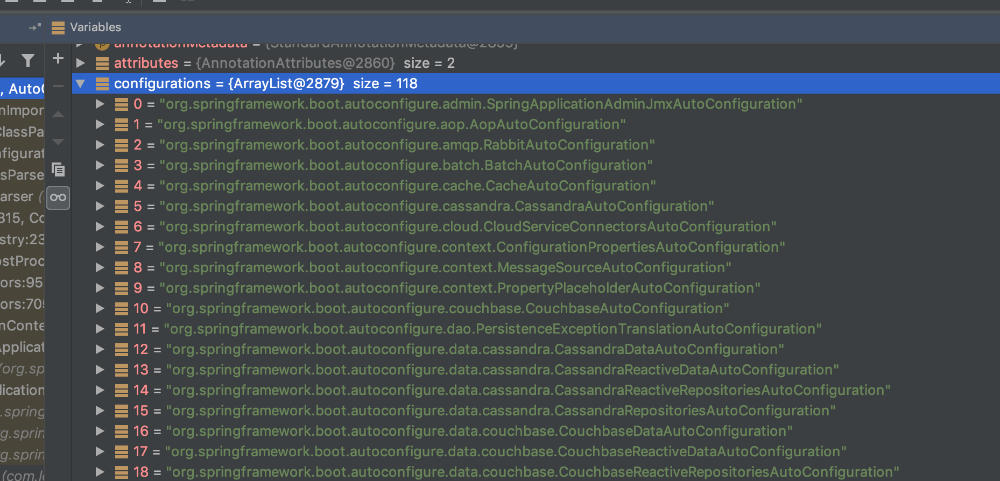

# 一，Spring boot 

## 1，HelloWorld 项目探究

[官方文档](https://docs.spring.io/spring-boot/docs/current/reference/html/index.html)

### 1， pom.xml

#### 1, 父项目

```xml
	<parent>
		<groupId>org.springframework.boot</groupId>
		<artifactId>spring-boot-starter-parent</artifactId>
		<version>2.1.4.RELEASE</version>
		<relativePath/> <!-- lookup parent from repository -->
	</parent>

他的父项目是

<parent>
<groupId>org.springframework.boot</groupId>
<artifactId>spring-boot-dependencies</artifactId>
<version>2.1.4.RELEASE</version>
<relativePath>../../spring-boot-dependencies</relativePath>
</parent>
他真正管理spring boot 应用里边的所有以来版本
```

spring boot的版本仲裁中心；

以后导入以来默认不需要写版本；若没有在dependencies中，则需要声明版本号。

#### 2，导入的依赖

```xml
		<dependency>
			<groupId>org.springframework.boot</groupId>
			<artifactId>spring-boot-starter-web</artifactId>
		</dependency>
```

Spring-boot-start-==web==
[starter](https://docs.spring.io/spring-boot/docs/current/reference/html/using-boot-build-systems.html#using-boot-starter)文档

spring-boot-starter：sping-boot场景启动器。帮我们导入了web模块正常运行所依赖的组件；

spring boot 将所有的功能场景都抽取出来，做成一个个的starters（启动器），只需要在项目中引入这些starter相关场景的所有以来都会导入进来，要用什么功能就导入什么场景的启动器。

### 2，主程序类，主入口类

```java
/*
 * SpringBootApplication用来标注一个主程序类，说明这是一个spring boot的应用
 */
@SpringBootApplication
public class SprintBootApplication {
    public static void main(String[] args) {
        SpringApplication.run(SprintBootApplication.class, args);
    }
}

```

**@SpringBootApplication**：spring boot应用标注在某个类上说明这个类为spring boot的主配置类， spring boot就应该运行这个类的main函数来启动spring boot应用。

```java
@Target({ElementType.TYPE})
@Retention(RetentionPolicy.RUNTIME)
@Documented
@Inherited
@SpringBootConfiguration
@EnableAutoConfiguration
@ComponentScan(
    excludeFilters = {@Filter(
    type = FilterType.CUSTOM,
    classes = {TypeExcludeFilter.class}
), @Filter(
    type = FilterType.CUSTOM,
    classes = {AutoConfigurationExcludeFilter.class}
)}
)
public @interface SpringBootApplication {}
```

@**SpringBootConfiguration**:  spring boot的配置类；

标注在某个类上，表示这是一个sping boot的配置类；

@Configuration：配置类上标注这个注解；

配置类——配置文件；配置类也是文件中的一个注解。

@**EnableAutoConfiguration**：开启自动配置功能

以前我们需要配置的东西，spring boot帮我们自动配置；@EnableAutoConfiguration告诉springboot开启自动配置功能；这样子自动配置才生效。

```java
@AutoConfigurationPackage
@Import({AutoConfigurationImportSelector.class})
public @interface EnableAutoConfiguration {
```

@**AutoConfigurationPackage**:自动配置包

@Import({Registrar.class})：spring的底层注解@Import，给容器中倒入一个组件；导入的组件由Registrar.class指定。

==将主配置类（@SpringBootApplication标注的类）的所在包以及下面所有子包留的所有组件扫描到Spring容器；==

@**Import**({AutoConfigurationImportSelector.class});

给容器导入组件？

AutoConfigurationImportSelector导入组件选择器：导入哪些组件的选择器；

将所有需要导入的组件以全类名的方式返回，这些组件就会被添加到容器中，会给容器中倒入非常多的自动配置类（xxAutoConfiguration）：就是给容器中倒入这个场景需要的所有组件，并配置好这些组件。



有了自动配置类，免去了手动编写配置和注入功能组件等的工作。


